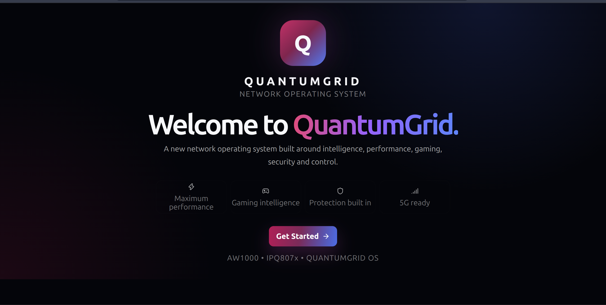
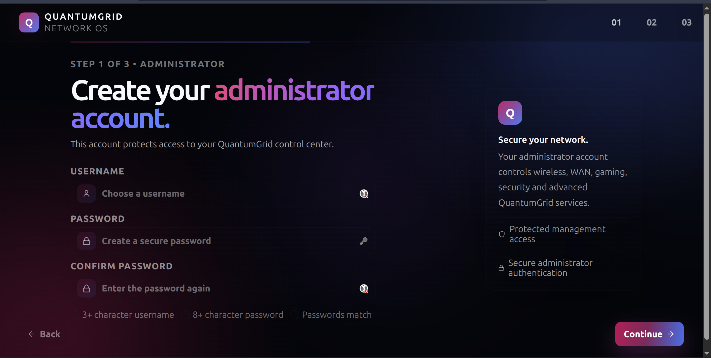
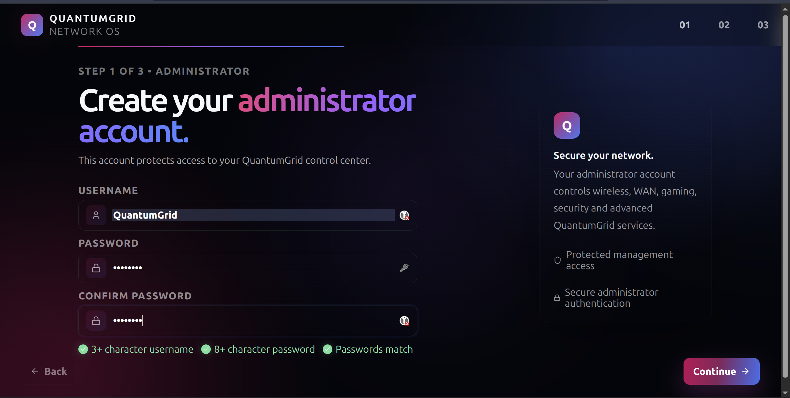
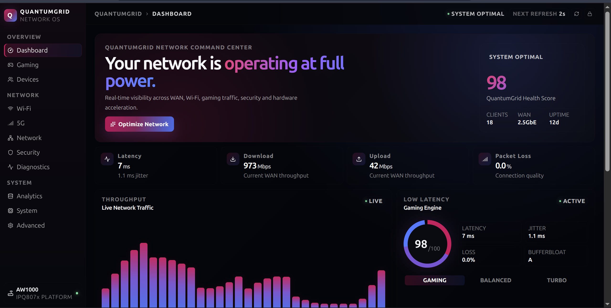
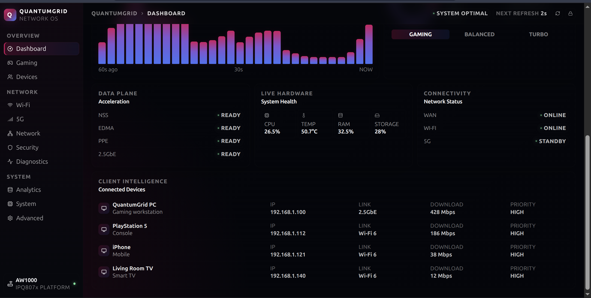
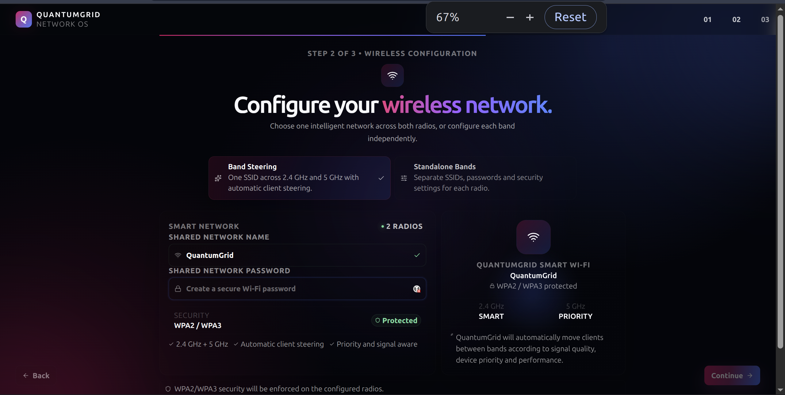
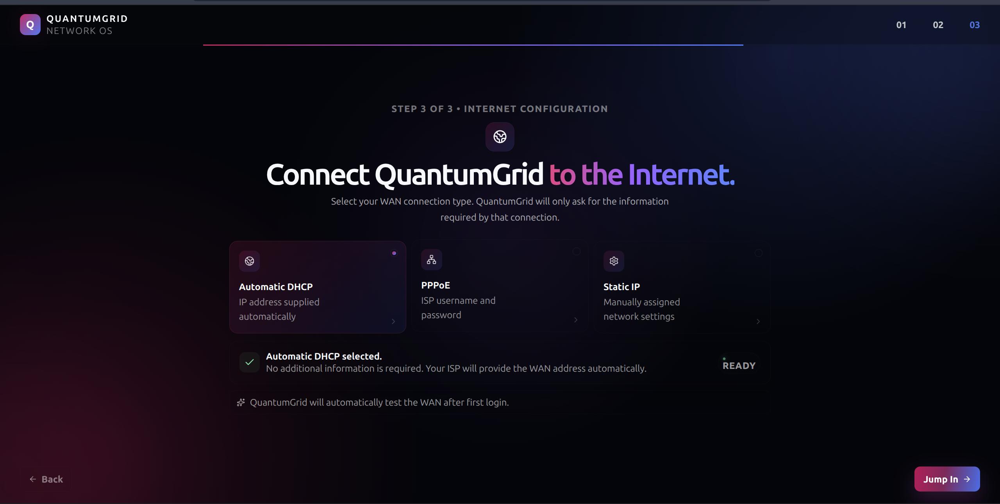
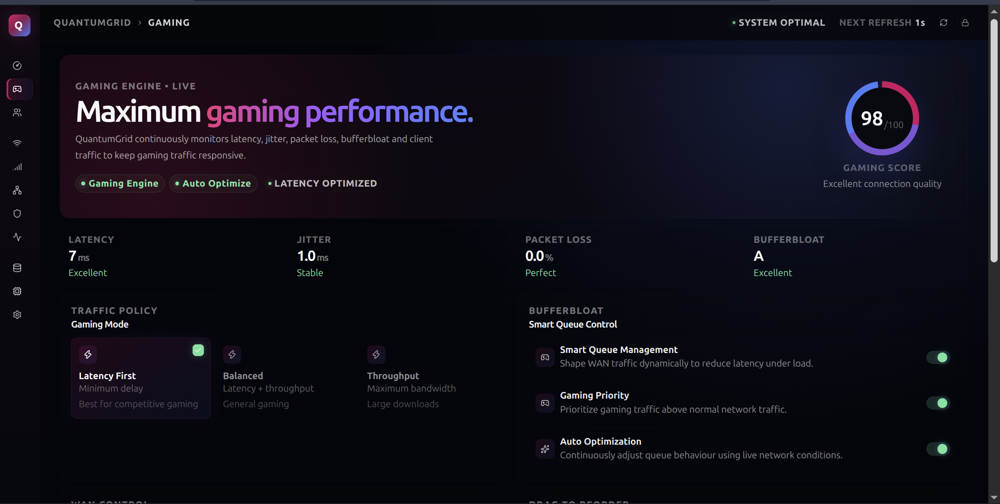
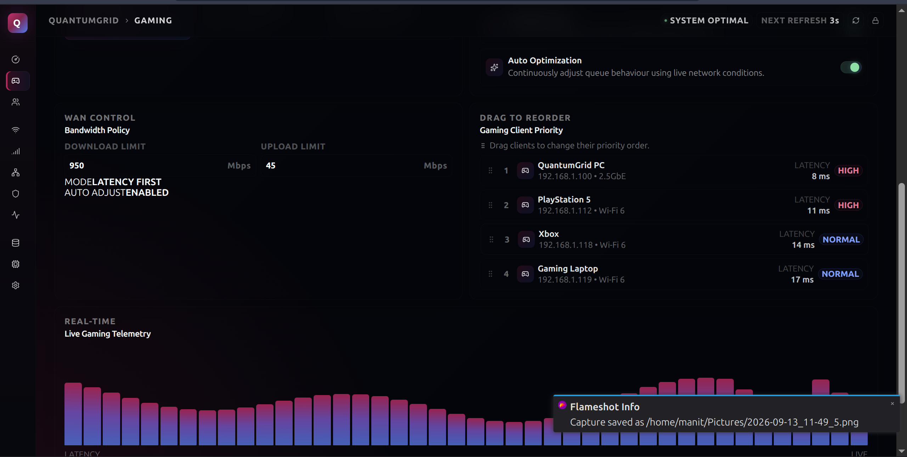
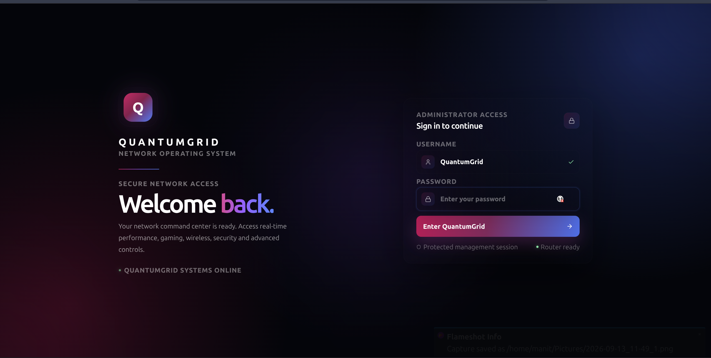

QuantumGrid OS

An intelligent, high-performance network operating system for modern routers.

QuantumGrid OS is an OpenWrt-based networking platform focused on **performance, gaming, Wi-Fi intelligence, security, 5G/cellular connectivity, telemetry and hardware acceleration**.

The goal is to build a complete network operating system — not simply a rebranded router interface.

Vision

QuantumGrid is designed to make advanced networking powerful without making it difficult to use.

Core areas include:

- Intelligent network optimization
- Gaming and low-latency networking
- Wi-Fi 6 management
- Band steering
- Device intelligence and prioritization
- WAN and routing control
- Network diagnostics
- Security and management controls
- 5G/cellular integration
- Real-time hardware telemetry
- NSS acceleration
- EDMA/PPE integration
- SSH and management ACLs
- A dedicated QuantumGrid control center

Current Hardware Target

Arcadyan AW1000

| Component | Target |
|---|---|
| Device | Arcadyan AW1000 |
| Platform | Qualcomm IPQ807x |
| OpenWrt | 25.12 |
| Target | `qualcommax` |
| Subtarget | `ipq807x` |
| Profile | `arcadyan_aw1000` |
| RAM | 1 GB |
| Ethernet | 2.5GbE |
| Wireless | Qualcomm Wi-Fi 6 |
| Cellular hardware | RG500Q-EA platform |

The current QuantumGrid configuration is already locked to the AW1000 target.

Architecture

                    QUANTUMGRID OS
                          │
        ┌─────────────────┼─────────────────┐
        │                 │                 │
     Control UI       Core Engine        Services
        │                 │                 │
     Wi-Fi           Telemetry             5G
     Gaming          Optimization          Security
     Devices         Policy                Updates
     System          Diagnostics           Network
                          │
                    Hardware Layer
                          │
                  ┌───────┼───────┐
                  │       │       │
                 NSS     EDMA     PPE
                  │       │       │
                  └───────┼───────┘
                          │
                    Qualcomm IPQ807x
=======
# QuantumGrid OS

**An intelligent, high-performance network operating system for modern routers.**

QuantumGrid OS is an OpenWrt-based networking platform focused on **performance, gaming, Wi-Fi intelligence, security, 5G/cellular connectivity, telemetry and hardware acceleration**.

The goal is to build a complete network operating system — not simply a rebranded router interface.

## Vision

QuantumGrid is designed to make advanced networking powerful without making it difficult to use.

Core areas include:

- Intelligent network optimization
- Gaming and low-latency networking
- Wi-Fi 6 management
- Band steering
- Device intelligence and prioritization
- WAN and routing control
- Network diagnostics
- Security and management controls
- 5G/cellular integration
- Real-time hardware telemetry
- NSS acceleration
- EDMA/PPE integration
- SSH and management ACLs
- A dedicated QuantumGrid control center

## QuantumGrid Control Center

QuantumGrid includes a modern control center designed to make advanced networking easy to understand and manage.

The interface combines real-time network telemetry, Wi-Fi configuration, gaming optimization, system controls, diagnostics and guided first-boot configuration into a single experience.

### First Boot Experience



### Administrator Setup





### Dashboard





### Wi-Fi & Internet





### Gaming





### Access Control




## Current Hardware Target

### Arcadyan AW1000

| Component | Target |
|---|---|
| Device | Arcadyan AW1000 |
| Platform | Qualcomm IPQ807x |
| OpenWrt | 25.12 |
| Target | `qualcommax` |
| Subtarget | `ipq807x` |
| Profile | `arcadyan_aw1000` |
| RAM | 1 GB |
| Ethernet | 2.5GbE |
| Wireless | Qualcomm Wi-Fi 6 |
| Cellular hardware | RG500Q-EA platform |

The current QuantumGrid configuration is already locked to the AW1000 target.

## Architecture

```text
                    QUANTUMGRID OS
                          │
        ┌─────────────────┼─────────────────┐
        │                 │                 │
     Control UI       Core Engine        Services
        │                 │                 │
     Wi-Fi           Telemetry             5G
     Gaming          Optimization          Security
     Devices         Policy                Updates
     System          Diagnostics           Network
                          │
                    Hardware Layer
                          │
                  ┌───────┼───────┐
                  │       │       │
                 NSS     EDMA     PPE
                  │       │       │
                  └───────┼───────┘
                          │
                    Qualcomm IPQ807x
